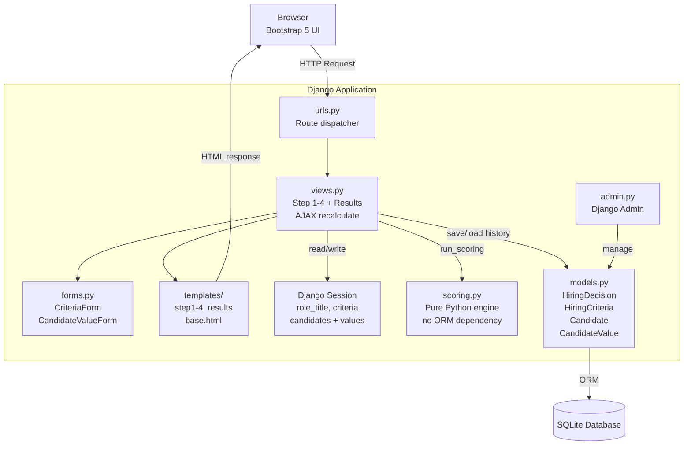
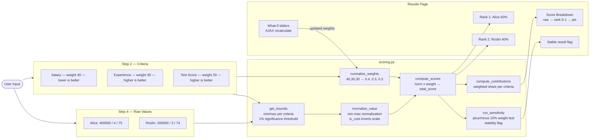
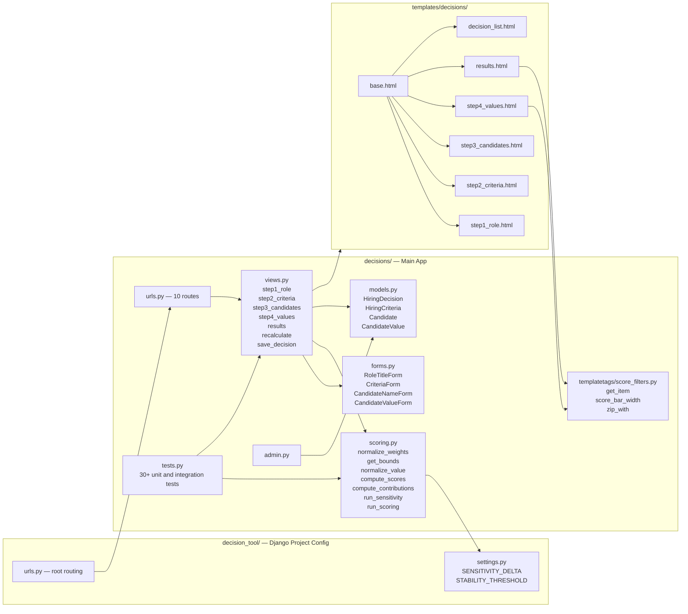
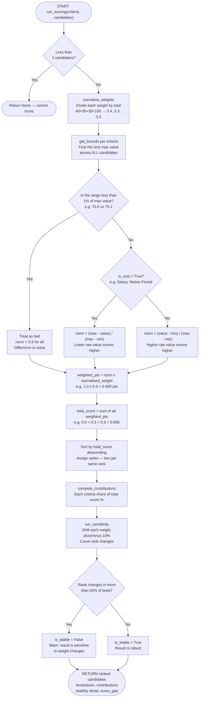

# Recruitment Companion — Hiring Decision Tool

A Django web application that helps recruiters make structured, data-driven hiring decisions using weighted multi-criteria scoring.

---

## How It Works

1. **Define the role** — enter the job title
2. **Set criteria** — add evaluation criteria, weights, and direction (higher or lower is better)
3. **Add candidates** — list all candidates being compared
4. **Enter values** — input raw actual values per candidate per criteria (e.g. salary=55000, experience=7, test score=82)
5. **View results** — candidates are ranked by weighted normalised score with full breakdown

---

## Architecture Diagram

> Shows how the system layers connect — browser, Django, scoring engine, and database.



---

## Data Flow Diagram

> Shows how raw input data travels through the system and becomes a ranked result.



---

## Component Diagram

> Shows all files in the project and how they depend on each other.



---

## Decision Logic Diagram

> Shows exactly how the scoring engine calculates a candidate's final score step by step.



---

## Setup

```bash
git clone https://github.com/yourusername/recruitment-companion.git
cd recruitment-companion/decision_tool

pip install -r requirements.txt
cp .env.example .env

python manage.py migrate
python manage.py runserver
```

Visit `http://127.0.0.1:8000`

---

## Scoring Formula

```
normalised_weight_i  =  weight_i / sum(all weights)

norm_value           =  (value - min) / (max - min)        # higher is better
norm_value           =  (max - value) / (max - min)        # lower is better (is_cost)
norm_value           =  0.5                                # all candidates identical

candidate_score      =  sum( norm_value_i x normalised_weight_i )
final_score_%        =  candidate_score x 100
```

---

## Project Structure

```
decision_tool/
├── decision_tool/
│   ├── settings.py
│   ├── urls.py
│   └── wsgi.py
├── decisions/
│   ├── models.py
│   ├── views.py
│   ├── forms.py
│   ├── scoring.py
│   ├── admin.py
│   ├── urls.py
│   ├── tests.py
│   ├── templatetags/
│   │   └── score_filters.py
│   └── templates/decisions/
│       ├── base.html
│       ├── step1_role.html
│       ├── step2_criteria.html
│       ├── step3_candidates.html
│       ├── step4_values.html
│       ├── results.html
│       └── decision_list.html
├── manage.py
├── requirements.txt
└── .env.example
```

---

## Tech Stack

| Layer | Technology |
|---|---|
| Backend | Python 3.13, Django 4.2 |
| Frontend | Bootstrap 5, Vanilla JS |
| Database | SQLite |
| Scoring Engine | Pure Python — no external ML libraries |
| Session Management | Django session framework |
